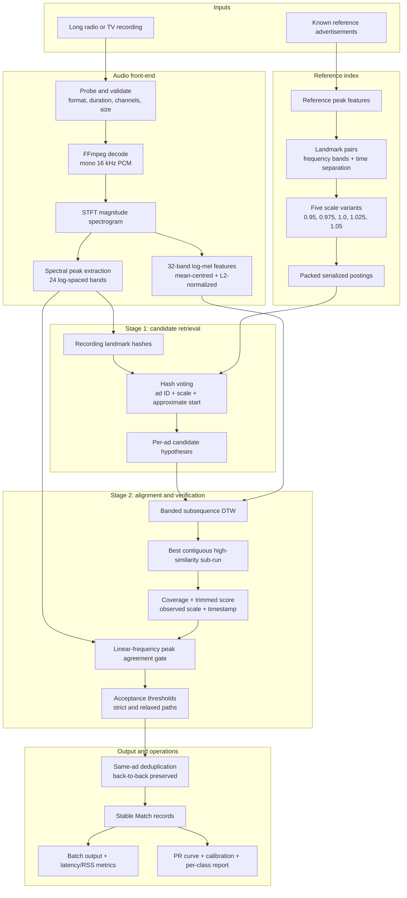

# audio-ad-detection

[](https://github.com/abdullaabdullazade/audio-ad-detection/actions/workflows/ci.yml)
[](go.mod)
[](LICENSE)

An open-source Go engine that finds every airing of known reference advertisements inside long radio and TV recordings, using audio fingerprinting, spectral peak matching, and dynamic time warping (DTW).

It matches a reference clip against broadcast audio that has been re-encoded, compressed, sped up, talked over, or cut short. It is not speech-to-text, generic audio classification, or exact waveform comparison.

Built for radio and TV monitoring, broadcast compliance, airtime verification, and media-monitoring pipelines.

**Contents:** [Why](#why) · [How it works](#how-it-works) · [Quick start](#quick-start) · [Go API](#go-api) · [Results](#results) · [Demo](#demo) · [Limitations](#known-limitations) · [Architecture](#project-layout) · [References](#references)

## Why

A reference advertisement is rarely identical to its on-air copy. Broadcast audio may contain:

- MP3/AAC codec and bitrate changes;
- loudness normalization, multiband compression, EQ, clipping, and gain changes;
- pitch-preserving time-scale changes of up to ±5%;
- pause compression, recorder gaps, fades, and partial airings;
- station music or announcer overlay;
- repeated or back-to-back airings;
- leading/trailing silence and mono/stereo differences.

Exact hashes and waveform comparison break under these transformations. This project treats the reference clip as an audio identity to retrieve and verify, not as a byte sequence to compare.

## Highlights

- Two-stage pipeline: fast fingerprint retrieval, then DTW verification.
- Partial-airing and time-scale-aware detection.
- Timestamp, duration, confidence, raw score, and scale factor for every match.
- Single-recording, batch, and evaluation CLI modes.
- Bounded concurrency, queue backpressure, and per-file fault isolation.
- Safe FFmpeg/FFprobe execution with input validation and cancellation.
- Serialized multi-scale index with incremental add/remove.
- Deterministic output, structured logging, metrics, health checks, and pprof.
- [Live results dashboard](https://abdullaabdullazade.github.io/audio-ad-detection/) with all 684 detected airings from three days of real radio, each playable.

## How it works



### Stage 1: landmark fingerprint retrieval

FFmpeg decodes each input to mono 16 kHz PCM. A short-time Fourier transform (STFT) produces a magnitude spectrogram, and spectral peaks are quantized into 24 log-spaced frequency bands.

Nearby peak pairs form landmark hashes made of the two bands and their time gap. The reference index stores these hashes at five time scales (0.95, 0.975, 1.0, 1.025, 1.05). Hashes from the recording vote for an advertisement ID, a scale, and an approximate start time.

The index also holds a pitch-invariant landmark variant, which keeps retrieval working when naive resampling shifts frequency and playback rate together.

### Stage 2: DTW alignment and verification

Each candidate is aligned with banded subsequence DTW over mean-centred, L2-normalized 32-band log-mel features. This makes similarity insensitive to overall loudness while keeping spectral shape.

The best contiguous high-similarity run gives the start and end of the airing, plus coverage, a trimmed-mean alignment score, and the observed time scale.

A final gate checks that reference spectral peaks appear at the same absolute frequencies in the recording. This pitch-sensitive check is what rejects convincing but unrelated music or speech.

### Deduplication

Same-ad detections that overlap by at least 35% collapse into the best-supported one. Each comparison is made against the current best span, so two separate back-to-back airings are never chained together. One airing produces one match.

## Quick start

Requirements: Go 1.26+, and FFmpeg/FFprobe on `PATH` (Linux, macOS, or Windows).

Install the CLI:

```bash
go install github.com/abdullaabdullazade/audio-ad-detection/cmd/finder@latest
```

Or build from source:

```bash
git clone https://github.com/abdullaabdullazade/audio-ad-detection.git
cd audio-ad-detection
go build -o finder ./cmd/finder
```

Find one advertisement in one recording:

```bash
finder --record record.mp3 --advert advert.mp3 --output json --min-confidence 0.5
```

Scan a directory of recordings against a directory of adverts:

```bash
finder batch \
  --records-dir records/ \
  --adverts-dir adverts/ \
  --workers 8 \
  --output json
```

Add `--metrics-addr :6060` to serve `/healthz`, `/metrics` (counters, gauges, latency percentiles), and `/debug/pprof/`.

Evaluate against labelled data:

```bash
finder eval \
  --records-dir records/ \
  --adverts-dir adverts/ \
  --labels labels.json \
  --out report.json
```

Environment overrides: `FINDER_OUTPUT`, `FINDER_MIN_CONFIDENCE`, `FINDER_WORKERS`, `FINDER_TIMEOUT`, `FINDER_METRICS_ADDR`, `FINDER_LOG_JSON`, `FINDER_RESAMPLE`.

## Go API

```go
import "github.com/abdullaabdullazade/audio-ad-detection/pkg/finder"

matches, err := finder.FindAdvertInRecord("record.mp3", "advert.mp3")
if err != nil {
    log.Fatal(err)
}
for _, m := range matches {
    fmt.Printf("%s at %.2fs (%.2fs long, confidence %.3f)\n",
        m.AdID, m.TimeSec, m.DurationSec, m.Confidence)
}
```

```go
type Match struct {
    AdID        string
    TimeSec     float64
    DurationSec float64
    Confidence  float64
    Score       float64
    ScaleFactor float64
}
```

| Field | Meaning |
|---|---|
| `AdID` | Reference advertisement ID, normally the filename without extension. |
| `TimeSec` | Start time from the beginning of the recording. |
| `DurationSec` | Duration of the matched run. |
| `Confidence` | Global monotonic confidence in [0, 1]. |
| `Score` | Raw Stage-2 alignment score. |
| `ScaleFactor` | Observed linear time scale; 1.0 means no change. |

The wrapper uses safe defaults and a 3-minute timeout. Batch and configured workloads use the internal detector packages directly.

## Results

### Synthetic benchmark

`cmd/gencorpus` builds a deterministic corpus from the three reference clips in `testdata/adverts`, applying every transformation listed under [Why](#why). Each corpus has 51 recordings and 50 airings.

| Metric | Dev (seed 1) | Held-out (seed 777) |
|---|---:|---:|
| Recall | 1.000 | 1.000 |
| Precision | 1.000 | 1.000 |
| F1 | 1.000 | 1.000 |
| Calibration ECE (10 bins) | 0.0000 | 0.0000 |
| Timestamp error, median | 0.012 s | 0.012 s |
| Timestamp error, p95 | 0.064 s | 0.064 s |

Every class scored full recall: baseline, transcode, gain/dynamics, tempo change, naive resample, pause compression, announcer overlay, partial airing, jingle trap, back-to-back, edge silence, and recording gap.

This is a small synthetic corpus. Treat it as a reproducible regression check, not a real-world accuracy guarantee.

Reproduce it:

```bash
go build -o gencorpus ./cmd/gencorpus
ADS=testdata/adverts/ad_1.mpeg,testdata/adverts/ad_2.mpeg,testdata/adverts/ad_3.mpeg

./gencorpus --adverts $ADS --out testdata/generated --seed 1
./finder eval --records-dir testdata/generated --adverts-dir testdata/adverts \
  --labels testdata/generated/labels.json --out report.json

./gencorpus --adverts $ADS --out /tmp/holdout --seed 777
./finder eval --records-dir /tmp/holdout --adverts-dir testdata/adverts \
  --labels /tmp/holdout/labels.json --out report_holdout.json
```

### Real radio archive

Three days of Azerbaijani radio (2026-06-11 to 2026-06-13): 1,153 recordings of 61 minutes each, about 1,171 audio-hours, from 16 stations. Batch scan with 8 workers at the default threshold:

| Day | Recordings | Audio-hours | Detections | Latency p50 / p95 / p99 | Throughput | Peak RSS |
|---|---:|---:|---:|---:|---:|---:|
| 2026-06-11 | 385 | 390.1 | 265 | 36.1 / 38.7 / 40.5 s | 10.1 rec/min | 12.3 GB |
| 2026-06-12 | 384 | 390.4 | 256 | 35.4 / 37.5 / 38.3 s | 10.3 rec/min | 11.5 GB |
| 2026-06-13 | 384 | 390.4 | 163 | 35.7 / 38.0 / 39.0 s | 10.2 rec/min | 11.2 GB |
| **Total** | **1,153** | **1,170.9** | **684** | | | |

No decode failures. The archive has no ground-truth labels, so these counts are not precision or recall figures; detections were checked by listening (every airing is playable in the [Demo](#demo)). The recordings themselves (about 32 GB) are not included.

### Confidence and threshold

Confidence is a global, monotonic score built from verified alignment quality and peak agreement, so it is comparable across advertisements.

The batch default threshold is **0.5**. On a real-broadcast calibration sample, genuine airings scored 0.9695–1.0000 and spurious candidates 0.0000–0.0024; 0.5 sits in the middle of that gap. The synthetic corpus cannot set this value, because all of its true positives saturate near 1.0 and it has no false-positive population.

`finder eval` reports its own operating point (maximum recall at a target precision). On the synthetic corpus that comes out near 0.999999, which is a property of the corpus and not a recommended production threshold. Recalibrate on new stations or audio domains.

### Reference index

| Metric | Value |
|---|---:|
| Cold load per 1,000 clips | 2.0 s |
| Serialized size per 1,000 clips | 234 MB |
| Add/remove without full rebuild | covered by tests |

Postings are packed into 7 bytes each, with times quantized to centiseconds.

### Committed result files

| Path | Contents |
|---|---|
| `results/synthetic/dev.json` | `finder eval` report, seed 1. |
| `results/synthetic/holdout.json` | `finder eval` report, seed 777. |
| `results/radio/2026-06-1{1,2,3}.json` | `finder batch` output per day: every recording, its matches, latency, and run stats. |

## Demo

**[abdullaabdullazade.github.io/audio-ad-detection](https://abdullaabdullazade.github.io/audio-ad-detection/)** is a results dashboard built from the official three-day scan: headline numbers, per-day run stats, airings by station and by hour, the confidence distribution, the synthetic benchmark, and a filterable table of all 684 detections with an audio player for each (every clip includes 2 s of context on each side).

The page lives in [`docs/`](docs/) and reads `docs/data/detections.json`; the per-day CSVs and clips are in `docs/data/`. `.github/workflows/pages.yml` deploys it on every push to `master`.

## Production properties

- FFmpeg/FFprobe run with explicit argument slices, never shell-interpolated paths.
- Every decode and subprocess call takes a context and honours cancellation.
- Input probing enforces format, duration, channel, and file-size limits.
- Batch mode uses a fixed worker pool and a bounded queue.
- A corrupt or truncated file is logged and skipped without aborting the batch.
- SIGINT/SIGTERM cancel in-flight work and shut down cleanly.
- Structured text or JSON logs via `slog`.
- Deterministic output ordering.
- Adjacent 61-minute segments are bridged so airings that cross a boundary are found.

## Known limitations

- The real archive has no ground truth, so listening checks are not a labelled precision/recall benchmark.
- The synthetic corpus is small and cannot represent every station, language, codec, or background mix.
- The time-scale path targets about ±5%; larger changes may be rejected or mistimed.
- The naive-resample recovery path (`FINDER_RESAMPLE`) is experimental, slower, enlarges the index, and is off by default.
- Short partial airings of an advert's second half are detected less reliably than first-half ones.
- Heavy overlay, gaps, and fades lower peak agreement and can cost recall.
- A heavily distorted airing split exactly at a segment boundary may still be missed.
- The pitch-sensitive peak gate improves precision on real air but can suppress some heavily overlaid or pitch-shifted partial matches.
- Tested with 3 reference clips; Stage-2 cost grows roughly linearly with the number of references.

## Project layout

```text
cmd/finder/            single, batch, and eval CLI
cmd/gencorpus/         deterministic synthetic corpus generator
cmd/cutmatches/        cuts detected airings into audio clips
cmd/evidence/          exports confidence evidence
pkg/finder/            stable public API
internal/audio/        FFmpeg probing, decoding, segment handling
internal/corpus/       synthetic broadcast transformations
internal/features/     STFT, log-mel, spectral peaks, resampling
internal/fingerprint/  landmark and quad fingerprints
internal/index/        multi-scale index and binary serialization
internal/match/        retrieval, voting, DTW alignment
internal/core/         detection, verification, deduplication, confidence
internal/eval/         labels, metrics, PR curve, calibration
internal/pipeline/     bounded worker pool and backpressure
internal/obs/          logging, metrics, health, pprof
```

## Development

```bash
gofmt -l .
go vet ./...
go test ./...
go test -race -timeout 60m ./...
```

Contributions should include focused tests and document any change to thresholds, confidence, benchmark data, or supported inputs. See [CONTRIBUTING.md](CONTRIBUTING.md) and [SECURITY.md](SECURITY.md). Never commit private recordings, generated corpora, or credentials.

## References

This is an independent implementation; no code was copied from the works below. They are the published ideas the detector builds on, each listed with the code that applies it.

### Fingerprinting and retrieval

1. A. Wang, "An Industrial-Strength Audio Search Algorithm," *Proc. 4th Int. Society for Music Information Retrieval Conf. (ISMIR)*, 2003. [PDF](https://www.ee.columbia.edu/~dpwe/papers/Wang03-shazam.pdf)
   Spectral peak constellations, landmark pair hashing, and offset voting — `internal/fingerprint/fingerprint.go`, `internal/match/retrieve.go`.
2. J. Six and M. Leman, "Panako – A Scalable Acoustic Fingerprinting System Handling Time-Scale and Pitch Modification," *Proc. 15th ISMIR Conf.*, 2014.
   Verifying a candidate by checking that reference peaks agree at one consistent frequency scaling — `internal/core/peak_verify.go`.
3. R. Sonnleitner and G. Widmer, "Quad-Based Audio Fingerprinting Robust to Time and Frequency Scaling," *Proc. 17th Int. Conf. on Digital Audio Effects (DAFx-14)*, 2014.
   Scale-invariant four-peak hashes and recovery of time and frequency scale factors — `internal/fingerprint/quad.go`, `internal/core/quad_detect.go`.
4. T.-K. Hon, L. Wang, J. D. Reiss, and A. Cavallaro, "Audio Fingerprinting for Multi-Device Self-Localization," *IEEE/ACM Trans. Audio, Speech, and Language Processing*, vol. 23, no. 10, pp. 1623–1636, 2015. [doi:10.1109/TASLP.2015.2442417](https://doi.org/10.1109/TASLP.2015.2442417)
   Landmark matching combined with time-delay histograms for noisy recordings — background for the voting and envelope cross-correlation stages.

### Alignment and time-delay estimation

5. H. Sakoe and S. Chiba, "Dynamic Programming Algorithm Optimization for Spoken Word Recognition," *IEEE Trans. Acoustics, Speech, and Signal Processing*, vol. 26, no. 1, pp. 43–49, 1978. [doi:10.1109/TASSP.1978.1163055](https://doi.org/10.1109/TASSP.1978.1163055)
   Band-constrained DTW — `internal/match/align.go`.
6. M. Müller, *Fundamentals of Music Processing*, Springer, 2015, ch. 7. [doi:10.1007/978-3-319-21945-5](https://doi.org/10.1007/978-3-319-21945-5)
   Subsequence DTW for locating a short query inside a long recording — `internal/match/align.go`.
7. C. Knapp and G. Carter, "The Generalized Correlation Method for Estimation of Time Delay," *IEEE Trans. Acoustics, Speech, and Signal Processing*, vol. 24, no. 4, pp. 320–327, 1976. [doi:10.1109/TASSP.1976.1162830](https://doi.org/10.1109/TASSP.1976.1162830)
   Generalized cross-correlation, the principle behind the global envelope check — `internal/match/envxcorr.go`.
8. H. A. Cordourier Maruri, P. López Meyer, J. Huang, J. A. del Hoyo Ontiveros, and H. Lu, "GCC-PHAT Cross-Correlation Audio Features for Simultaneous Sound Event Localization and Detection (SELD) on Multiple Rooms," DCASE 2019 Challenge Technical Report, 2019.
   GCC-based features for robust delay estimation — background for `internal/match/envxcorr.go`.

### Evaluation

9. M. P. Naeini, G. F. Cooper, and M. Hauskrecht, "Obtaining Well Calibrated Probabilities Using Bayesian Binning," *Proc. AAAI Conf. on Artificial Intelligence*, 2015.
10. C. Guo, G. Pleiss, Y. Sun, and K. Q. Weinberger, "On Calibration of Modern Neural Networks," *Proc. 34th Int. Conf. on Machine Learning (ICML)*, 2017. [arXiv:1706.04599](https://arxiv.org/abs/1706.04599)
    Expected and maximum calibration error over confidence bins — `internal/eval/calibration.go`.

### Software

- [FFmpeg](https://ffmpeg.org/) — decoding, probing, and the synthetic corpus transformations (`internal/audio`, `internal/corpus`). Invoked as an external process, not linked.
- [Gonum](https://www.gonum.org/) (BSD-3-Clause) — FFT for the STFT front-end (`internal/features/stft.go`); the only Go module dependency.

## License

[MIT](LICENSE) © 2026 Abdulla Abdullazade
